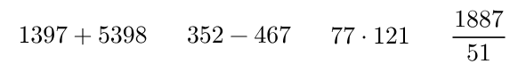

# Laskutoimitukset ja muuttujat

### Terminaali

Kun avaat IDLE:n, ensimmäisenä eteesi avautuu Pythonin terminaali. Terminaaliiin voi kirjoittaa yksittäisiä komentoja ja ne suorittuvat heti. Kokeillaan hiukan miten terminaali toimii!

### Laskutoimitukset

Yksinkertaisimmat komennot, joita terminaaliin voi kirjoittaa, ovat erilaiset laskutoimitukset. Pythonilla voi laskea helposti vaikkapa yhteen-, vähennys-, kerto ja jakolaskuja. Erilaiset laskutoimitukset ovat tärkeitä myös monimutkaisemmissa ohjelmissa.

### Muuttujat

Kun haluamme ottaa tietoa talteen myöhempää käyttöä varten, tarvitsemme muuttujia. Muuttuja on kuin laatikko tietokoneen muistissa. Laatikkoon merkitään päälle mitä laatikon sisällä on ja laitetaan asia laatikkoon. Myöhemmin oikeat asiat on helppo löytää nimikoiduista laatikoista.

Samalla tavalla muuttujalle annetaan nimi ja siihen talletetaan arvoja. Esimerkiksi voimme nimetä muuttujan _luku_ ja laittaa sinne arvon 17. Tämä tehdään Pythonissa komennolla ```luku = 17```. Ensin siis sanotaan muuttujan nimi, sen jälkeen tulee yhtäsuuruusmerkki ja sitten muuttujaan laitettava arvo.

Kun myöhemmin koodissamme kirjoitamme muuttujamme nimen, tietokone etsii muistista muuttujan arvon ja käyttää sitä.


### Esimerkkejä

| koodi | mitä tekee |
| ----- | ---------- |
| 1+2 |laskee lukujen 1 ja 2 summan eli tulos on 3|
| 2-6 | laskee lukuje 2 ja 6 erotuksen eli tulos on -4 |
| 2*2 | laskee lukujen 2 ja 2 tulon eli tulos on 4 |
| 10/5 | laskee lukujen 10 ja 5 osamäärän eli tulos on 2 |
| luku = 1 | tallentaa muuttujaan nimeltä _luku_ arvon 1 |
| luku + 4 | laskee muuttujan _luku_ arvon ja luvun 4 summan |
| luku1*luku2 | laskee muuttujien _luku1_ ja _luku2_ arvojen tulon |


### Tehtävät

1. Avaa Idlen terminaali. Seuraavat tehtävät tehdään terminaalissa.

1. Laske alla olevat laskut Pythonin terminaalissa:

    

1. Laske alla olevat laskut Pythonin terminaalissa:

    

1. Luo muuttuja nimeltä ikä ja tallenna muuttujaan oma ikäsi.

1. Laske ikäsi viiden vuoden päästä muuttujan avulla.

1. Luo muuttuja munikä, johon tallennat oman ikäsi. Luo muuttuja sunikä ja tallenna siihen vierustoverisi ikä. Laske ikänne yhteen muuttujien avulla.