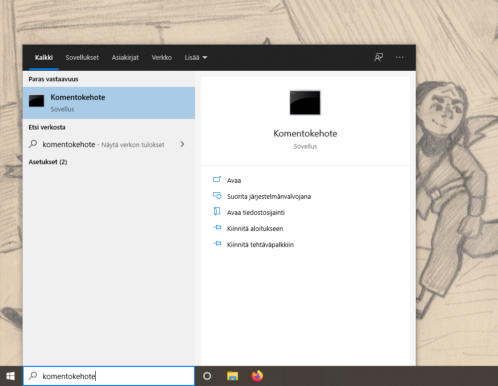

## Pyglet ja peliohjelmointi

Kaikkea ohjelmoidessa ei kannata tehdä itse. Sen sijaan ohjelmoidessa kannattaa käyttää apuna muiden tekemiä _kirjastoja_. Kirjastojen idea on, että joku muu on tehnyt koodia, jota voi kätevästi käyttää itse niin, että säästyy suurelta määrältä työtä.

Pyglet on Pythonille tarkoitettu kirjasto, josta löytyy pelien tekemistä varten kaikenlaista kätevää. Jotta Pygletin kirjastoa pääsee käyttämään, tulee sekin asentaa koneelle.

### pip ja Pygletin asennus

Python-kirjastoja voi asentaa pip:llä. Uusimpien Python-asennusten mukana asentuu myös pip.

> Jos käytät linux-konetta, voit tarkistaa onko sinulla pip kirjoittamalla terminaaliin `pip --version`. Jos terminaaliin tulostuu pipin versio, sinulla on jo pip. Muuten voit asentaa sen kirjoittamalla terminaaliin `sudo apt-get install pip` ja seuraamalla terminaalin antamia asennusohjeita.

Kun koneella on pip, mennään asentamaan Pyglet! Avaa koneesi terminaali.

#### Terminaali Windows-koneella
Paina Windows-näppäintä ja kirjoita hakukenttään _komentokehote_ tai _cmd_.



Valitse hakutuloksista komentokehote ja sinulle pitäisi aueta seuraavanlainen näkymä:


#### Terminaali Applen koneella

Paina ⌘ ja välilyöntiä samaan aikaan ja kirjoita ilmestyneeseen hakukenttään _terminaali_ tai jos koneesi on englanniksi _terminal_. Avaa terminaali.

#### Terminaali Linux-koneella
Paina nappeja Ctrl, Alt ja T samaan aikaan.

---

Pygletin saa asennettua kirjoittamalla terminaaliin komento:

```pip3 install pyglet --user```

Seuraa mahdollisia asennusohjeita.

Nyt pyglet on asennettu ja voit käyttää sitä ohjelmissasi.

### Pygletin käyttö

Jotta Python-ohjelma osaa käyttää haluttuja kirjastoja, tulee ne lisätä ohjelman alussa komennolla
```import kirjasto```

Tästä lähtien siis kun teemme ohjelmia, joissa haluamme käyttää pyglettiä, kirjoitamme ohjelman ensimmäiselle riville `import pyglet`.