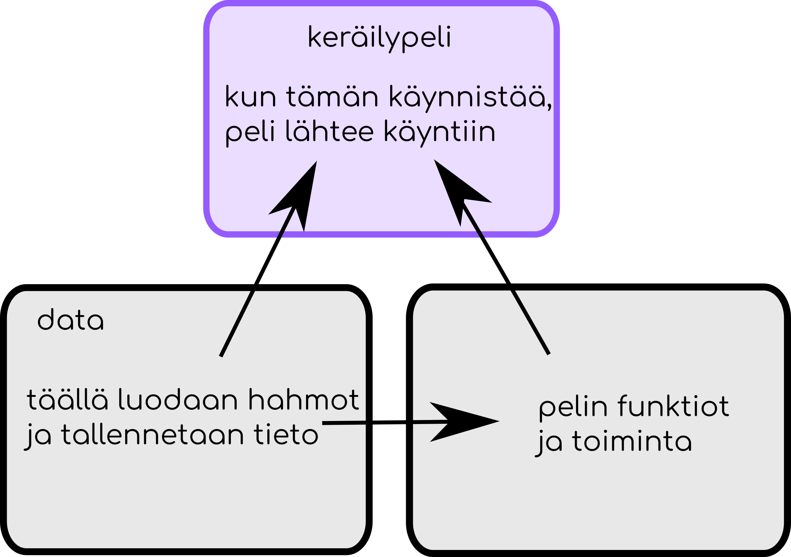

# Keräilypeli

Keräilypelissä kuljetaan ympäri pelikenttää ja keräillään asioita. Asioiden keräämisestä saa pisteitä. Lisäksi kentällä pelaajaa jahtaa pahis, jota kuuluu väistellä. Jos pahis saa pelaajan kiinni, peli päättyy.

## Pelin tiedostorakenne

Viime osassa käsittelimme moduuleja ja nyt kun alamme oikeasti ohjelmoida peliä, on hirveän hyödyllistä, että voimme jakaa koodin useaan eri tiedostoon. Koodin voi tietysti jakaa todella monella eri tavalla, mutta jotkin tavat ovat toisia kätevämpiä. Tässä ohjeessa koodi on jaettu kolmeen tiedostoon seuraavalla tavalla.



