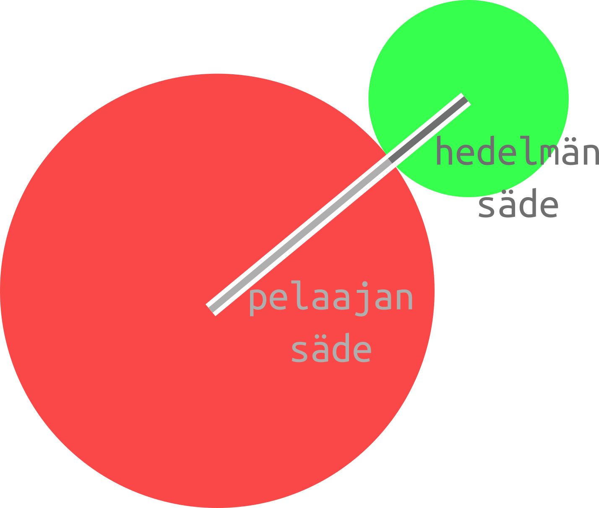
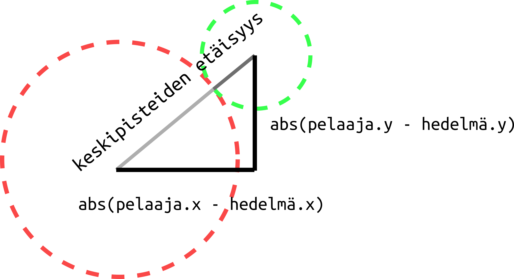

## Keräiltävä esine

Seuraavaksi tehdään peliin keräiltävä "hedelmä". Hedelmä voi olla hyvin vaikkapa pienempi ympyrä. Luodaan hedelmä data.py-tiedostossa. Hedelmä voi olla vaikkapa vihreä. Talennetaan kätevyyden nimissä vihreä väri ensin muuttujaan `VIHREÄ` ja käytetään sitä hahmon luonnissa. Hedelmän x- ja y-sijainti kannattaa myös valita niin, että se ei aloita pelaajahahmon alta.

```Python3
VIHREÄ = 0, 255, 0

hedelmä = pyglet.shapes.Circle(x = 400, y = 500, color = VIHREÄ, radius = 10)
```

## Laitetaan ikkuna piirtämään hedelmä

Lisätään keräilypeli.py-tiedostoon `on_draw()`-funktioon hedelmän piirtäminen komennolla `data.hedelmä.draw()`.

Nyt hedelmän pitäisi näkyä pelikentällä.


## Hedelmien kerääminen

Haluamme, että hedelmiä voi kerätä. Koodataankin seuraavaksi funktio, joka kokeilee onko pelaaja osunut hedelmään ja sen perusteella mahdollisesti siirtä hedelmän uuteen paikkaan.

Tämä on pelin logiikkaa, joten siirrytään tiedostoon logiikka.py.

### Miten tiedetään onko pelaaja hedelmän luona?

Pohditaan ensin hiukan miten tiedämme, että pelaaja on osunut hedelmään. Tähän tarvitaan matematiikkaa ja tietoa suorakulmaisesta kolmiosta ja pythagoraan lauseesta. Jos et tiedä kunnolla mikä on suorakulmainen kolmio, voit tutkia asiaa vaikkapa wikipediasta: [https://fi.wikipedia.org/wiki/Suorakulmainen_kolmio]

Jos matematiikka ei yhtään kiinnosta, niin voit vain kopioida pohdinnan alla olevan koodin. Muista kuitenkin, että josset ymmärrä mistä koodissa on kyse, et osaa luultavasti itse tulevaisuudessa hyödyntää sitä omissa ohjelmissasi.




Havainnekuvista nähdään, että hedelmä ja pelaaja osuvat toisiinsa jos niiden välinen etäisyys on yhtä suuri (tai pienempi), kuin niiden säteet yhteensä. Miten voimme laskea pelaajan ja hedelmän välisen etäisyyden?



Etäisyys voidaan selvittää apukolmion avulla. Suorakulmaisen kolmion kateetit voidaan laskea hedelmän ja pelaajan koordinaattien avulla. x-akselin suuntaisen kateetin pituuden voi laskea `abs(data.pelaaja.x - data.hedelmä.x)` ja y-akselin suuntaisen kateetin vastaavasti `abs(data.pelaaja.y - data.hedelmä.y)`.

Suorakulmaisella kolmiolla pätee, että hypotenuusan neliö on yhtä suuri kuin neliöiden summa. On vielä otettava huomioon, että etäisyys voi olla pienempi, kuin säteet yhteensä (kun pelaaja ja hedelmä ovat päällekkäin). Siispä jos haluamme testata onko osuma tapahtunut, se onnistuu komennolla `abs(data.pelaaja.x - data.hedelmä.x)**2 + abs(data.pelaaja.y - data.hedelmä.y)**2 <= (data.pelaaja.radius + data.hedelmä.radius)**2`.

> Pythonissa potenssi merkitään `**`.

Jos tämä "väite" pitää paikkaansa, koskettavat pelaaja ja hedelmä toisiaan. Kirjoitetaan siis funktio tiedostoon logiikka.py

```Python3
def hedelmään_osumisen_tarkistus(dt):
    if (data.pelaaja.radius + data.hedelmä.radius)**2 > abs(data.pelaaja.x - data.hedelmä.x)**2 + abs(data.pelaaja.y - data.hedelmä.y)**2:
```

### Hedelmän siirtyminen uuteen paikkaan

if-lauseen sisälle voidaan ohjelmoida mitä tapahtuu, kun pelaaja koskettaa hedelmää. Haluamme että hedelmä siirtyy uuteen satunnaiseen paikkaan. Satunnaisuutta varten meidän tulee ottaa käyttöön satunnaisuus. Kirjoitetaan tiedoston logiikka.py alkuun `import random`.

Hedelmä saa satunnaisen sijainnin, kun sille annetaan uusi satunnainen x-koordinaatti ja satunnainen y-koordinaatti. Satunnainen luvun joltain väliltä saa komennolla `random.randint(mistä, mihin)`. x-koordinaatti on jokin luku nollasta ikkunan leveyteen ja y-koordinaatti on jotain nollasta ruudun korkeuteen. Siis jos pelaaja osuu hedelmään pitää muuttaa hedelmän sijaintia seuraavasti:


```Python3
def hedelmään_osumisen_tarkistus(dt):
    if (data.pelaaja.radius + data.hedelmä.radius)**2 > abs(data.pelaaja.x - data.hedelmä.x)**2 + abs(data.pelaaja.y - data.hedelmä.y)**2:
        data.hedelmä.x = random.randint(0, 800)
        data.hedelmä.y = random.randint(0, 600)
```