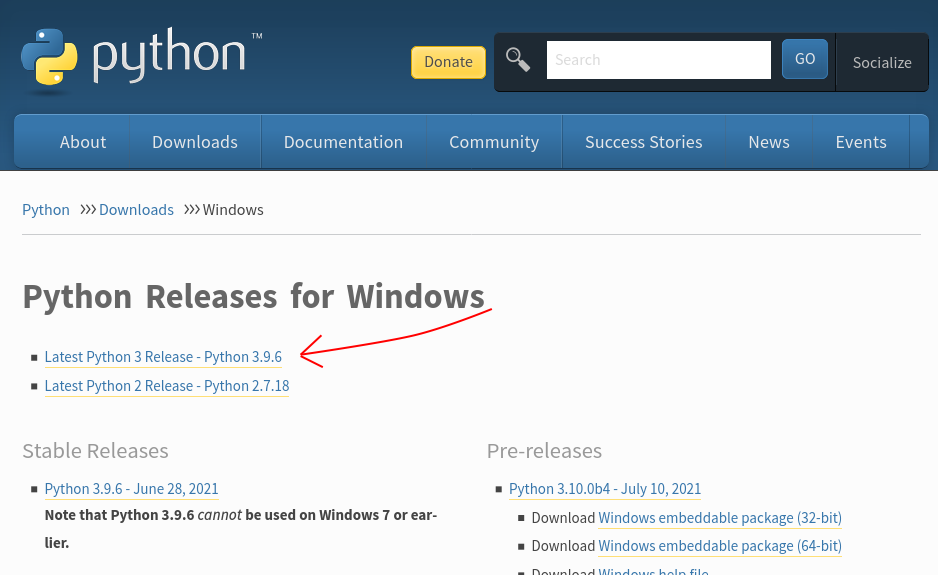
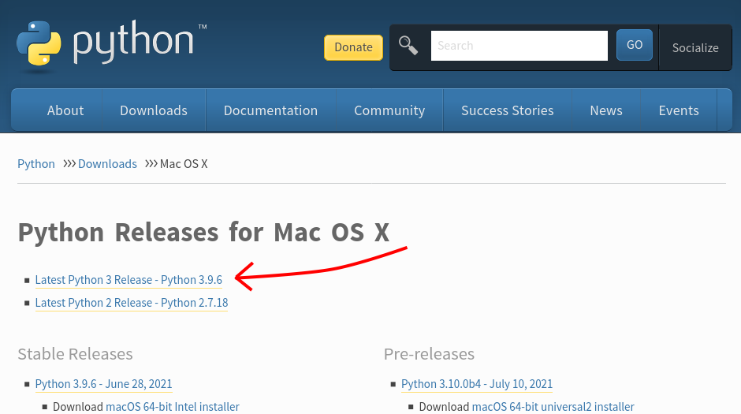

# Python

Python on ohjelmointikieli, eli erä tapa kertoa tietokoneelle mitä sen pitää tehdä. 

## Miten asentaa Python omalle koneelle

Jotta tietokone osaa lukea Pythonilla kirjoitettua koodia, pitää koneelle olla asennettuna Python-tulkki. Tämän tulkin asennusta kutsutaan Pythonin asentamiseksi. Pythonilla on omat kotisivut [python.org](python.org), joilta Pythonin voi ladata. Pythonin asennus on hiukan erilaista riippuen siitä millaista tietokonetta käyttää.

### Windows-koneelle asentaminen

Python Windowsille löytyy osoitteesta [https://www.python.org/downloads/windows/](https://www.python.org/downloads/windows/). Valitse sivulla olevista linkeistä _Latest Python 3 release_ eli viimeisin Python 3 -julkaisu.



Ladattuasi kyseisen paketin, suorita se ja asenna saamiesi ohjeiden mukaisesti.

### Applen Mac OS-koneelle asentaminen

Python Applen koneille löytyy osoitteesta [https://www.python.org/downloads/mac-osx/](https://www.python.org/downloads/mac-osx/). Valitse sivulla olevista linkeistä _Latest Python 3 release_ eli viimeisin Python 3 -julkaisu.



Ladattuasi kyseisen paketin, suorita se klikkaamalla ja asenna ohjeiden mukaisesti.

### Linux-konelle

Suurimmassa osassa linux-koneita on Python valmiiksi. Voit tarkistaa löytyykö sinulta jo Python näin:
- Avaa komentorivi painamalla samaan aikaan nappeja Ctrl, Alt ja T.
- Kirjoita komentoriville
```bash
python3 --version
```
Jos koneelle on jo asennettu Python, terminaaliin pitäisi tulostua Pythonin versio näin:


Jos tietokone ei kerro Pythonin versiota, koneella ei ole Pythonia. Sen saa asennettua suurimmassa osassa linuxeja termiaalista komennolla:

```bash
sudo apt-get install python3
```
Kopioi siis tämä terminaaliin ja seuraa mahdollisia asennusohjeita.

## Pythonkoodin kirjoittaminen

Kun koneelle on asennettu Python, osaa kone suorittaa Pythonilla kirjoitettua koodia.
Python-ohjelmat ovat tiedostoja joissa on tekstiä. Näitä tiedostoja voi kirjoittaa tietokoneesta riippuen muun muassa muistiolla, geditillä, vimillä ja IDLE:llä. Aloittelijat kannattaa käyttää IDLE:ä. Linuxilla voi myös käyttää tekstieditoria ja terminaalia.

