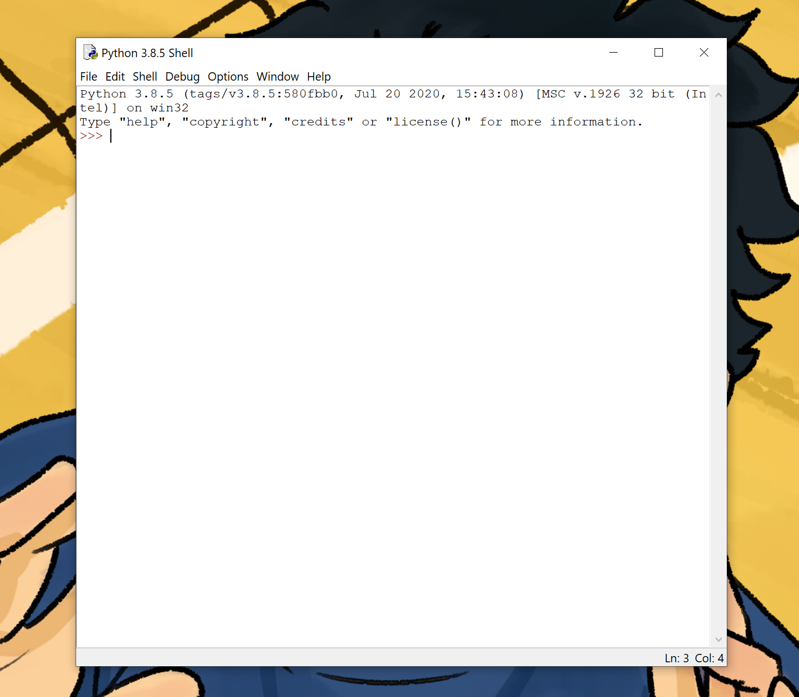
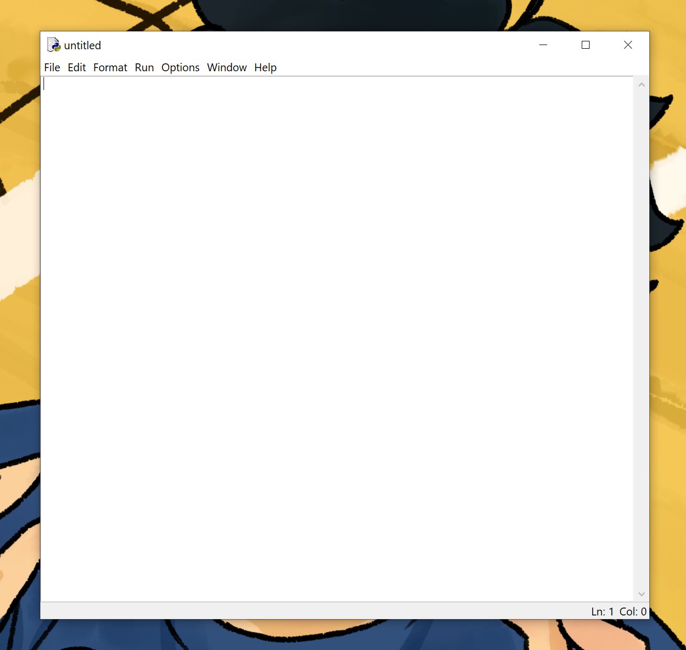
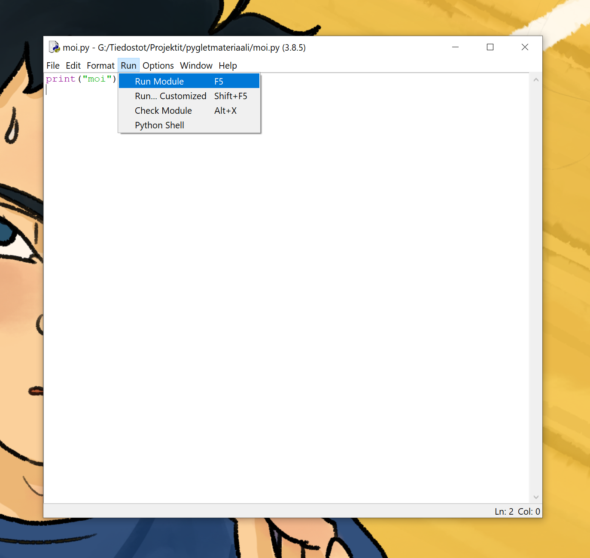

# IDLE

Pythonia asentaessa koneellesi on samalla asennettu IDLE-niminen ohjelmointiympäristö. Avaa se ja se näyttää suunnilleen tältä:



Tämä on IDLE:n oma terminaali, jonne voi muun muassa kokeilla erilaisia komentoja suoraan tai ohjelma voi kirjoittaa sinne tekstiä.

## Tiedosto, ohjelman tallentaminen ja suorittaminen

Luodaksesi tiedoston, mihin voit alkaa kirjoittaa koodia valitse IDLE:n ylälaidasta _File_ ja sieltä _New File_. Avautuu uusi ikkuna nimeltä _untitled_, johon koodia voi alkaa kirjoittaa.



Tallenna juuri luotu tiedosto painamalla nappeja Ctrl ja S. Valitse mihin tallennat tiedoston ja anna tiedostolle nimi (vaikka moi). Omia koodauksia varten kannattanee tehdä oma kansio, että ne löytyvät myöhemmin helposti.

Kun tiedosto on tallennettu, tiedoston ikkunan yläreunassa ei enää lue _untitled_ vaan tiedoston nimi. Nimi loppuu _.py_, josta tietokone tietää, että kyseessä on Python-ohjelma.

Nyt voit alkaa kirjoittaa koodia tiedostoon. Aloitetaan yksinkertaisella ohjelmalla, joka tulostaa IDLE:n terminaaliin _moi_.

Pythonissa saa tulostettua terminaaliin tekstiä komennolla _print_. Kirjoita tyhjään tiedostoon:
```Python3
print("moi")
```
Tallenna koodi painamalla taas Ctrl ja S. Nyt ohjelman voi suorittaa ikkunan ylälaidasta kohdasta _Run_, josta löytyy _Run Module_. Voit myös painaa näppäimistölläsi nappia f5 (löytyy näppäimistön yläreunasta).



Nyt IDLE:n terminaaliin tulostuu teksti _moi_, ja se näyttää suunnilleen tältä:


Onnittelut! Teit ensimmäisen Python-ohjelmasi :)